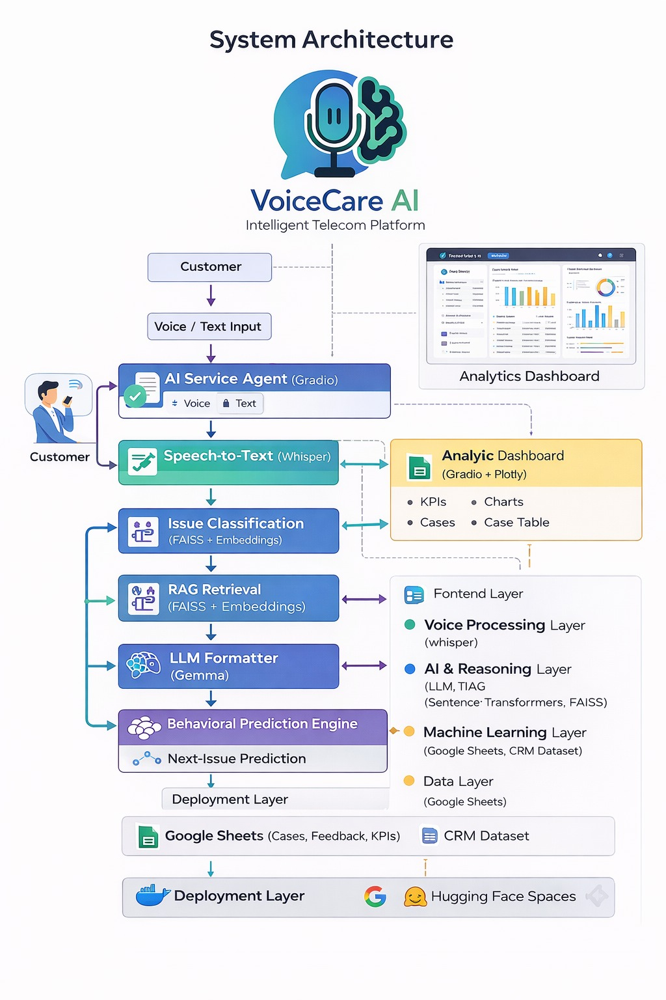

# 🎙️ VoiceCare AI – Intelligent Telecom Service Agent 📡🤖

**VoiceCare AI** is a production-grade, AI-powered telecom customer service platform designed to automate complaint handling, improve customer experience, and provide actionable operational insights for telecom operators.

The system unifies **Voice AI**, **Large Language Models (LLMs)**, **Retrieval-Augmented Generation (RAG)**, **Machine Learning behavioral prediction**, **CRM integration**, and a **real-time analytics dashboard** into a single intelligent service agent.

---

## 🚀 Key Features

### 🎤 Voice-Based Complaint Handling
- Speech-to-Text using **Whisper**
- Arabic-optimized for real telecom customer language
- Hands-free complaint submission via voice or audio files

### 🤖 AI Service Agent (LLM + RAG)
- LLM-powered troubleshooting responses
- RAG pipeline using **FAISS + Sentence Transformers**
- Step-by-step guided resolution

### 🧠 Intelligent Issue Classification
Automatically classifies issues such as:
- Internet Down
- Slow Internet
- Router Issues
- Billing Issues
- Landline Problems
- Roaming & Offers

Includes confidence scoring and decision source tracking.

### 🔮 Behavioral Issue Prediction
- Predicts the customer’s next likely issue
- Learns behavioral patterns from historical cases
- Ensemble ML models (Random Forest, XGBoost, LightGBM)

### 📞 CRM Integration
- Customer lookup via normalized phone numbers
- Displays customer profile, subscription, and bundle info
- Supports registered and unregistered customers

### 📊 Live Analytics Dashboard
- Real-time KPIs (cases, resolution rate, time, rating)
- Interactive charts and tables
- Built with **Gradio + Plotly**

### 🔁 Self-Learning & Retraining
- Feedback-driven dataset enrichment
- Admin-triggered model retraining
- Designed with MLOps principles

### 🐳 Production-Ready Deployment
- Fully Dockerized
- Deployed on Hugging Face Spaces
- Secure environment-variable-based configuration

---

## 🏗️ System Architecture



**Architecture Overview:**
- Frontend Layer: AI Agent UI + Analytics Dashboard (Gradio)
- Voice Processing Layer: Whisper Speech-to-Text
- AI & Reasoning Layer: Issue Classification + RAG + LLM
- Machine Learning Layer: Behavioral Prediction Engine
- Data Layer: Google Sheets + CRM Dataset
- Deployment Layer: Docker + Hugging Face Spaces

---

## 🛠️ Tech Stack

### Backend & AI
- Python 3.10
- PyTorch
- Transformers
- Sentence-Transformers
- FAISS
- Whisper (faster-whisper)
- Scikit-learn
- XGBoost
- LightGBM

### Data & Analytics
- Pandas
- NumPy
- Plotly
- Google Sheets API

### UI & Deployment
- Gradio
- Docker
- Hugging Face Spaces

---

```text
VoiceCare-AI/
├── app.py
├── Dockerfile
├── requirements.txt
├── README.md
├── .gitignore
│
├── assets/
│   ├── logo.png
│   ├── agent_ui.png
│   └── dashboard.png
│
├── data/
│   └── README.md
│
├── models/
│   └── README.md
│
└── vector_store/
    └── README.md

```

---

## 📋 Prerequisites
- Python 3.10+
- Docker
- FFmpeg (for audio processing)
- Google Sheets API access
- Hugging Face account

---

## ⚙️ Environment Variables

```env
HF_TOKEN=your_huggingface_token
GOOGLE_SERVICE_ACCOUNT='{}'
ADMIN_PASSWORD=******
⚠️ All secrets are excluded from the repository.
```

---

## ⚙️ Installation & Run (Docker)
```bash
docker build -t voicecare-ai .
docker run -p 7860:7860 voicecare-ai
```
Access the application:
👉 http://localhost:7860

---

## 🌐 Live Demo

🔗 Hugging Face Space – VoiceCare AI
https://huggingface.co/spaces/youssefmoustafa172/VoiceCare-AI

---

## 👥 Meet the Team

| Name           | Role        |
| -------------- | ----------- |
| Eman Taha      | AI Engineer |
| Menna Osama    | AI Engineer |
| Mariam Maged   | AI Engineer |
| Shorok Mohamed | AI Engineer |

---

## 🔐 Security & Privacy
- No credentials stored in code
- No customer data exposed
- Models and vector indexes excluded from GitHub
- Privacy-first system design
---

## 📄 License

This project is intended for educational, research, and demonstration purposes.

---


